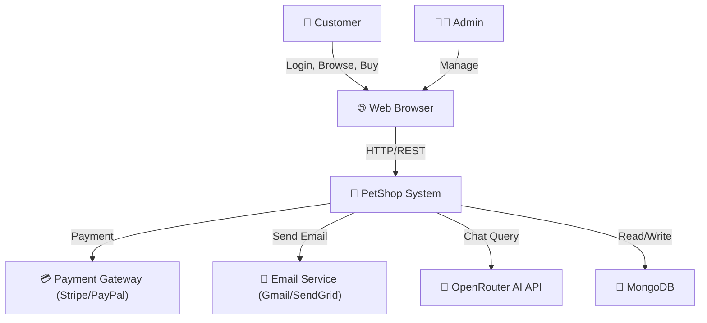
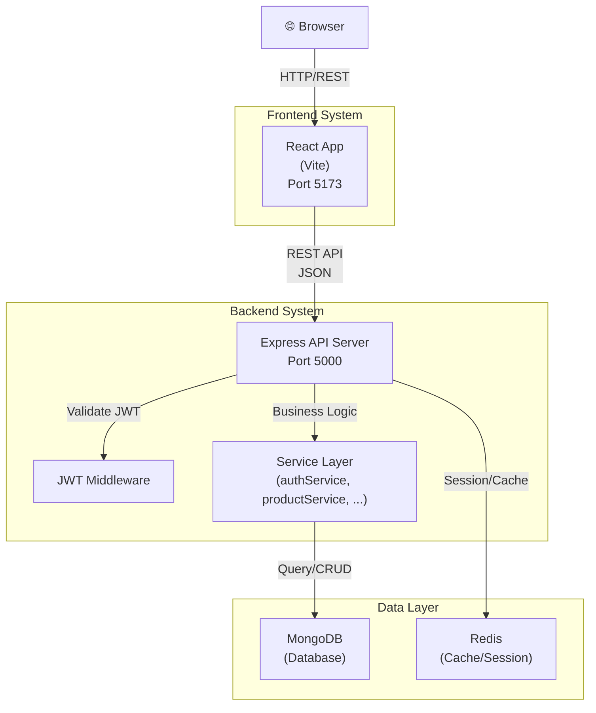

# 📋 Đánh Giá Toàn Diện Dự Án - Chi Tiết Hoàn Thành & Cần Bổ Sung

**Ngày đánh giá:** 01/06/2026

---

## 🎯 TỔNG QUAN

| Tiêu Chí | Điểm Tối Đa | Hoàn Thành | % | Trạng Thái |
|---------|------------|-----------|---|-----------|
| **1. Project Organization** | 1.0 | ~0.7 | 70% | ⚠️ Thiếu GitLab link + Google Drive |
| **2. Architecture Styles** | 3.0 | ~1.8 | 60% | ⚠️ Cần C4 diagrams chi tiết + trade-off |
| **3. Architecture Characteristics** | 3.0 | ~2.3 | 77% | ✅ Tốt, cần Scalability + Monitoring |
| **4. DevOps** | 1.5 | ~1.2 | 80% | ✅ Docker + CI/CD, cần Deploy thực tế |
| **5. AI** | 1.5 | ~0.8 | 53% | ⚠️ Cần AI Agent workflow chi tiết |
| **TOTAL** | **10.0** | **~6.8** | **68%** | 🟡 Phần bộ |

---

## ✅ PHẦN 1: PROJECT ORGANIZATION (1.0 điểm)

### 1.1 GitLab Repository & Git Workflow

**Status:** ⚠️ **THIẾU**

**Cần làm:**
- [ ] Thêm link GitLab vào **README.md** (đầu tiên)
- [ ] Đảm bảo repository có:
  - Branch strategy rõ ràng (`main`, `develop`, `feature/*`, `bugfix/*`)
  - Commit history chi tiết từng thành viên
  - Pull Request / Merge Request với mô tả

**Gợi ý:**
```markdown
# GitLab Repository
- Link: https://gitlab.com/your-group/nhom1-project
- Branch main: chứa code production
- Branch develop: chứa code development
- Feature branches: `feature/auth`, `feature/product-management`
```

---

### 1.2 Agile / Scrum Management

**Status:** ✅ **HOÀN THÀNH** (70%)

**Đã có:**
- ✅ [AGILE_BACKLOG.md](AGILE_BACKLOG.md) - Product backlog với ưu tiên
- ✅ [AGILE_SPRINT_1.md](AGILE_SPRINT_1.md) - Sprint plan & kết quả
- ✅ [AGILE_ROADMAP.md](AGILE_ROADMAP.md) - Lộ trình phát triển
- ✅ [AGILE_RETRO.md](AGILE_RETRO.md) - Retrospective meeting

**Cần bổ sung:**
- [ ] Phân công công việc chi tiết cho từng thành viên trong mỗi sprint
- [ ] Ghi lại task estimation (story points hoặc hour estimate)
- [ ] Burndown chart hoặc velocity tracking
- [ ] Sprint review notes (demo, feedback from stakeholders)

---

### 1.3 Functions List (Chức Năng Hệ Thống)

**Status:** ⚠️ **THIẾU TÀI LIỆU CHI TIẾT**

**Có nhưng chưa tài liệu đủ:**
- ✅ Đăng ký / Đăng nhập (JWT + Redis)
- ✅ Quản lý sản phẩm (CRUD)
- ✅ Giỏ hàng
- ✅ Đặt hàng
- ✅ Review sản phẩm
- ✅ AI chatbot (OpenRouter)
- ✅ Dashboard admin
- ✅ Quản lý người dùng

**Cần làm:**
- [ ] Tạo file `FUNCTIONS_LIST.md` chi tiết:
  - Mô tả từng chức năng
  - Use case hoặc user story
  - Screenshot hoặc wireframe
  - Priority và status hiện tại

**Ví dụ:**
```markdown
## Chức Năng 1: Xác Thực Người Dùng (Authentication)
- **Mô tả:** Người dùng có thể đăng ký tài khoản mới, đăng nhập bằng email + password
- **Use Case:** UC01 - User Registration, UC02 - User Login
- **Công nghệ:** JWT + Redis session
- **Status:** ✅ Hoàn thành
- **Priority:** 🔴 Cao

## Chức Năng 2: AI Chat Assistant
- **Mô tả:** Người dùng có thể chat với AI để hỏi đáp về sản phẩm
- **API:** POST /api/ai/chat
- **Status:** ✅ Hoàn thành (với retry mechanism)
- **Priority:** 🟡 Trung bình
```

---

## ✅ PHẦN 2: ARCHITECTURE STYLES (3.0 điểm)

### 2.1 C4 Context Diagram

**Status:** ⚠️ **CÓ SƠ ĐỒ NHƯNG CHƯA CHUẨN C4**

**Hiện tại:**
- ✅ Có file [ARCHITECTURE_DIAGRAM.md](ARCHITECTURE_DIAGRAM.md) mô tả layer architecture
- ❌ Chưa có C4 Context diagram chuẩn (actors, external systems)

**Cần làm:**
- [ ] Tạo **C4 Context Diagram** mô tả:
  - **Actors:** Customer, Admin, System
  - **External Systems:** Payment Gateway, Email Service, OpenRouter AI, MongoDB Atlas
  - **Phạm vi:** Hệ thống quản lý bán lẻ pet shop online

**Ví dụ (Mermaid):**


---

### 2.2 C4 Container Diagram

**Status:** ⚠️ **CÓ NHƯNG CHƯA CHI TIẾT**

**Hiện tại:**
- ✅ Có mô tả frontend, backend, database, cache
- ❌ Chưa là C4 Container diagram chuẩn

**Cần làm:**
- [ ] Tạo **C4 Container Diagram** mô tả:
  - **Frontend Container:** React/Vite SPA (port 5173)
  - **Backend Container:** Express.js API (port 5000)
  - **Database Container:** MongoDB
  - **Cache Container:** Redis
  - **Giao tiếp:** HTTP/REST, TCP connections



---

### 2.3 System Design Architecture Diagram

**Status:** ⚠️ **CÓ NHƯNG CẦN LÀM RÕ LUỒNG**

**Hiện tại:**
- ✅ Có layer architecture (Presentation → Business → Data)
- ❌ Chưa rõ luồng xử lý dữ liệu end-to-end (request → response)

**Cần làm:**
- [ ] Vẽ **Request-Response Flow** chi tiết

```mermaid
graph LR
    User["👤 User<br/>Browser"]
    
    UI["🎨 UI Component<br/>(Page/Form)"]
    Hook["🪝 Custom Hook<br/>(useState, useEffect)"]
    Service["💼 API Service<br/>(axiosInstance)"]
    Rate["⚙️ Client Rate Limiter<br/>(5 req/min)"]
    
    Route["📍 Express Route"]
    Auth["🔐 Auth Middleware<br/>(JWT verify)"]
    Limiter["⚙️ Server Rate Limiter"]
    Controller["🎯 Controller<br/>(Business Logic)"]
    DBService["💼 Service Layer"]
    Query["💾 MongoDB Query"]
    
    Cache["🔄 Redis Cache"]
    
    User -->|Click Button| UI
    UI -->|setState| Hook
    Hook -->|API Call| Service
    Service -->|Check Rate Limit| Rate
    Rate -->|HTTP POST| Route
    Route -->|JWT Token| Auth
    Auth -->|Check Limit| Limiter
    Limiter -->|Forward| Controller
    Controller -->|Check Cache| Cache
    Cache -->|Hit/Miss| DBService
    DBService -->|Query| Query
    Query -->|Result| DBService
    DBService -->|Set Cache| Cache
    DBService -->|Data| Controller
    Controller -->|JSON Response| Route
    Route -->|HTTP 200| Service
    Service -->|Parse Data| Hook
    Hook -->|Re-render| UI
    UI -->|Display Data| User
```



---

### 2.4 Advantages & Disadvantages

**Status:** ⚠️ **THIẾU PHÂN TÍCH**

**Cần làm:** Tạo file `ARCHITECTURE_ANALYSIS.md` phân tích:

**Ưu điểm của Layer Architecture:**
- ✅ **Tách biệt trách nhiệm:** UI ≠ Logic ≠ Data → dễ test từng layer
- ✅ **Dễ bảo trì:** Thay đổi UI không ảnh hưởng business logic
- ✅ **Tái sử dụng code:** Service có thể gọi từ nhiều route
- ✅ **Dễ debug:** Lỗi được định vị ở layer nào
- ✅ **Scalability:** Dễ thêm chức năng (thêm route + service + model)

**Nhược điểm:**
- ❌ **Chậm hơn monolithic:** Gọi qua nhiều layer = overhead
- ❌ **Complexity:** Cần hiểu từng layer để code hiệu quả
- ❌ **Dữ liệu lớn:** Service xử lý trở nên phức tạp nếu data lớn
- ❌ **N+1 Query Problem:** Dễ mắc lỗi nếu không dùng cache/batch query

---

### 2.5 Compare with Other Architectures

**Status:** ❌ **THIẾU**

**Cần làm:** So sánh với các kiến trúc khác:

```markdown
## So Sánh Kiến Trúc

| Kiến Trúc | Phù Hợp | Không Phù Hợp | Điểm Số |
|----------|---------|--------------|--------|
| **Layer (Hiện tại)** | Dự án vừa, team nhỏ (5-10 người) | Microservices scale lớn | 7/10 |
| **Microservices** | Scale lớn, team lớn (20+), nhiều service độc lập | MVP, startup nhỏ | 3/10 |
| **MVC** | Web truyền thống (server-side render) | SPA modern | 2/10 |
| **Monolithic** | Startup, prototype nhanh | Long-term scalability | 2/10 |
| **Event-Driven** | Real-time, event-based (order → notification) | CRUD đơn giản | 5/10 |
| **CQRS + Event Sourcing** | Audit trail, complex business logic | MVP, CRUD đơn giản | 3/10 |

### Lý Do Chọn Layer Architecture:
1. ✅ **Team nhỏ (5 người):** Không cần complexity của microservices
2. ✅ **Startup/MVP:** Phát triển nhanh, deploy đơn giản
3. ✅ **Maintainability:** Dễ mở rộng khi thêm chức năng
4. ✅ **Cost:** 1 server Node + 1 MongoDB + 1 Redis = chi phí thấp
```

---

### 2.6 Trade-off Analysis

**Status:** ⚠️ **CẦN PHÂN TÍCH**

```markdown
## Đánh Đổi Kiến Trúc (Trade-off)

### 1️⃣ Hiệu Năng (Performance)
- **Trade-off:** Request phải qua 3-4 layer (Route → Controller → Service → DB)
- **Giải pháp:** Redis cache, Client rate limiter (5 req/min), Database indexing
- **Kết quả:** Response time ~200-500ms (acceptable cho e-commerce)

### 2️⃣ Chi Phí (Cost)
- **Trade-off:** Cần 3 service (Backend, MongoDB, Redis) + Nginx
- **Giải pháp:** Docker Compose, shared hosting (Heroku, Railway, render.com)
- **Kết quả:** ~$5-20/month cho MVP

### 3️⃣ Độ Phức Tạp (Complexity)
- **Trade-off:** Cần hiểu 3 layer + JWT + Redis session
- **Giải pháp:** Tài liệu, code examples, team training
- **Kết quả:** Onboarding team mới ~1-2 tuần

### 4️⃣ Khả Năng Mở Rộng (Scalability)
- **Trade-off:** Layer architecture tới ~100K users bị giới hạn
- **Giải pháp:** Load balancer, DB replication, Redis cluster (nâng cấp sau)
- **Kết quả:** Hiện tại support ~10K users, sau 2 năm nâng cấp

### 5️⃣ Khả Năng Bảo Trì (Maintainability)
- **Trade-off:** Thêm feature = thêm 3 file (route, service, controller)
- **Giải pháp:** Code generator, templates, naming convention
- **Kết quả:** ✅ Dễ bảo trì, tái sử dụng code
```

---

### 2.7 Contextual Questions (Hỏi-Đáp về Kiến Trúc)

**Status:** ⚠️ **CẦN CHUẨN BỊ TRẢ LỜI**

Cần chuẩn bị câu trả lời chi tiết cho các tình huống:

1. **Nếu traffic tăng gấp 10 lần (từ 1K lên 10K users/ngày)?**
   - Giải pháp: Load balancer (Nginx), database replication, Redis cluster
   - Từng bước: Optimize queries → Add caching → Horizontal scaling → Microservices (sau)

2. **Nếu service MongoDB bị down 1 giờ?**
   - Giải pháp: Backup MongoDB hàng ngày, replicate tới secondary instance
   - Fallback: Cache dữ liệu thường xuyên dùng trong Redis

3. **Nếu Redis bị expire data tại thời điểm cao điểm?**
   - Giải pháp: Increase Redis memory, set expires hợp lý (session 24h, cache 1h)
   - Monitor: Alert khi Redis memory > 80%

4. **Nếu hacker spam 1M requests tới API?**
   - Giải pháp: Client rate limiter (5 req/min), Server rate limiter (100 req/min/IP), IP whitelist/blacklist
   - Middleware: Verify JWT token trước khi xử lý

5. **Nếu cần rollback code nhưng data đã thay đổi?**
   - Giải pháp: Database migrations (migrate-mongo), versioning API (/v1/, /v2/)
   - Backup: Backup MongoDB trước mỗi deploy

---

## ✅ PHẦN 3: ARCHITECTURE CHARACTERISTICS (3.0 điểm)

### 3.1 Availability 24/7

**Status:** ⚠️ **THIẾU PHẦN PRODUCTION**

**Hiện tại:**
- ✅ Docker Compose chạy local OK
- ❌ Chưa deploy lên server công cộng (no production URL)

**Cần làm:**
- [ ] Deploy lên cloud (Heroku, Railway, Render.com, hoặc VPS)
- [ ] Cấu hình health check: `GET /api/health` → return `{status: 'ok'}`
- [ ] Cấu hình auto-restart: systemd, Docker restart policy, PM2

**Ví dụ Docker restart policy:**
```yaml
services:
  backend:
    image: petshop-backend
    restart: always  # ← Auto-restart nếu crash
    healthcheck:
      test: ["CMD", "curl", "-f", "http://localhost:5000/api/health"]
      interval: 30s
      timeout: 10s
      retries: 3
```

---

### 3.2 Performance – Redis Caching

**Status:** ✅ **HOÀN THÀNH** (80%)

**Đã có:**
- ✅ [back-end/server/configs/redisClient.js](back-end/server/configs/redisClient.js) - Redis connection
- ✅ Redis dùng để lưu session (auth), refresh token
- ✅ Rate limiter data lưu trong Redis

**Cần bổ sung:**
- [ ] **Product caching:** Lưu danh sách sản phẩm, category vào Redis TTL 1 giờ
- [ ] **Cache invalidation:** Khi user thêm/sửa sản phẩm → clear cache tương ứng
- [ ] **Redis monitoring:** Kiểm tra Redis memory, hit rate

**Ví dụ caching sản phẩm:**
```javascript
// productService.js
async getProducts(page = 1, limit = 10) {
  const cacheKey = `products:page${page}:limit${limit}`;
  
  // Kiểm tra cache
  const cached = await redisClient.get(cacheKey);
  if (cached) {
    return JSON.parse(cached);  // ← Hit cache, return ngay
  }
  
  // Miss cache, query database
  const products = await Product.find()
    .limit(limit)
    .skip((page - 1) * limit);
  
  // Lưu vào Redis với TTL 1 giờ
  await redisClient.setex(cacheKey, 3600, JSON.stringify(products));
  
  return products;
}

// Khi update product → clear cache
async updateProduct(id, data) {
  const updated = await Product.findByIdAndUpdate(id, data);
  
  // Clear tất cả cache sản phẩm
  const keys = await redisClient.keys('products:*');
  if (keys.length > 0) {
    await redisClient.del(...keys);  // ← Invalidate cache
  }
  
  return updated;
}
```

---

### 3.3 Fault Tolerance – Client Rate Limiter

**Status:** ✅ **HOÀN THÀNH**

**Bằng chứng:**
- ✅ [front-end/src/utils/axiosInstance.js](front-end/src/utils/axiosInstance.js) - Client rate limiter
- ✅ Giới hạn 5 requests/phút per endpoint
- ✅ Khi vượt → hiển thị toast warning

**Hoạt động:**
```javascript
// Ví dụ: User spam click "Add to Cart" 10 lần
- Click 1-5: ✅ Request gửi thành công
- Click 6-10: ❌ Blocked by client rate limiter (toast warning)
- Toast: "Quá nhiều request, vui lòng đợi 60s"
```

**Cần bổ sung:**
- [ ] Thêm logging: Track quần lợi rate-limited requests
- [ ] Config API: Cho phép adjust rate limit từ server (5, 10, 20 req/min)

---

### 3.4 Fault Tolerance – Retry Mechanism

**Status:** ✅ **HOÀN THÀNH**

**Bằng chứng:**
- ✅ [back-end/server/controllers/AIController.js](back-end/server/controllers/AIController.js) - Retry with backoff
- ✅ Max 3 attempts, delay 3-5s với jitter
- ✅ Exponential backoff: 3s → 6s → 9s

**Hoạt động:**
```javascript
// AI Chat API - Retry mechanism
async chatWithAI(prompt) {
  const maxRetries = 3;
  let attempt = 0;
  
  while (attempt < maxRetries) {
    try {
      const response = await callOpenRouterAPI(prompt);
      return response;  // ← Success
    } catch (error) {
      attempt++;
      
      if (attempt < maxRetries) {
        const delay = (3 + attempt * 3) * 1000;  // 3s, 6s, 9s
        await sleep(delay + Math.random() * 1000);  // Add jitter
        console.log(`Retry attempt ${attempt}/${maxRetries}`);
      } else {
        throw new Error('AI service unavailable after 3 attempts');
      }
    }
  }
}
```

**Cần bổ sung:**
- [ ] Áp dụng retry cho các API khác (Payment, Email service)
- [ ] Circuit breaker pattern (nếu 5 lần fail liên tiếp → skip retry)

---

### 3.5 Fault Tolerance – Server Rate Limiter

**Status:** ✅ **HOÀN THÀNH**

**Bằng chứng:**
- ✅ [back-end/server/middleware/rateLimiter.js](back-end/server/middleware/rateLimiter.js) - Express rate limiter
- ✅ [back-end/server/middleware/loginLimiter.js](back-end/server/middleware/loginLimiter.js) - Login rate limiter

**Cấu hình:**
- Login: 5 attempts / 15 phút
- API chung: 100 requests / phút / IP
- Return: HTTP 429 Too Many Requests

**Cần bổ sung:**
- [ ] Whitelist IP trusted (nếu có partner API)
- [ ] Differentiate rate limit: Admin (500 req/min), User (100 req/min), Guest (20 req/min)

---

### 3.6 Security – JWT Authentication

**Status:** ✅ **HOÀN THÀNH**

**Bằng chứng:**
- ✅ [back-end/server/controllers/authController.js](back-end/server/controllers/authController.js) - JWT creation
- ✅ [back-end/server/middleware/authMiddleware.js](back-end/server/middleware/authMiddleware.js) - JWT verification
- ✅ AccessToken (15 min) + RefreshToken (7 days) trong Redis

**Hoạt động:**
```javascript
// Login
POST /api/auth/login
→ Verify password
→ Create accessToken (15 min), refreshToken (7 days)
→ Store refreshToken in Redis
→ Return {accessToken, refreshToken}

// Gọi API
GET /api/products
Header: Authorization: Bearer <accessToken>
→ Middleware verify JWT signature + expiry
→ Extract userId từ token
→ Cho phép request

// Token expire
→ Frontend gọi /api/auth/refresh-token
→ Backend verify refreshToken từ Redis
→ Return accessToken mới
```

**Cần bổ sung:**
- [ ] HTTPS mandatory (không cho HTTP production)
- [ ] Secure cookie flag cho token (HttpOnly, Secure, SameSite)
- [ ] Token rotation: Sau mỗi refresh, invalidate old token

---

### 3.7 Scalability

**Status:** ⚠️ **CÓ THIẾT KẾ NHƯNG CHƯA TRIỂN KHAI**

**Hiện tại:**
- ✅ Kiến trúc layer hỗ trợ scale
- ❌ Chưa deploy trên production (nên không có data về scaling)

**Cần làm:**

#### **Scale Ngang (Horizontal Scaling):**
```
Lần 1: 1 Backend + 1 MongoDB + 1 Redis
↓
Lần 2 (traffic tăng):
    Load Balancer (Nginx) 
        ↓
    Backend 1, Backend 2, Backend 3
        ↓
    MongoDB Replication (Primary + 2 Secondary)
    Redis Cluster (3 nodes)
```

- [ ] Cấu hình Nginx load balancer (round-robin)
- [ ] MongoDB replication set
- [ ] Redis cluster (hoặc Redis Sentinel)
- [ ] Session sharing (Redis lưu, tất cả backend access)

#### **Scale Dọc (Vertical Scaling):**
- Upgrade server từ 2GB RAM → 8GB RAM, 2 CPU → 8 CPU
- Database indexing, query optimization

**Ví dụ Nginx load balancer:**
```nginx
upstream backend {
    server backend1:5000;
    server backend2:5000;
    server backend3:5000;
}

server {
    listen 80;
    server_name api.petshop.com;
    
    location /api {
        proxy_pass http://backend;
    }
}
```

---

## ✅ PHẦN 4: DevOps (1.5 điểm)

### 4.1 Maintainability – Clean Code & Architecture

**Status:** ✅ **HOÀN THÀNH** (80%)

**Đã có:**
- ✅ Cấu trúc thư mục rõ ràng: `controllers/`, `services/`, `models/`, `routes/`, `middleware/`
- ✅ Service layer tách biệt logic (auth, product, cart, order, review)
- ✅ Error handling chuẩn hóa
- ✅ Middleware cho auth, rate limiter, logging

**Cần bổ sung:**
- [ ] Thêm JSDoc comments cho các function quan trọng
- [ ] Unit tests cho services (Jest)
- [ ] Integration tests cho API endpoints
- [ ] Code review checklist

**Ví dụ JSDoc:**
```javascript
/**
 * Lấy danh sách sản phẩm
 * @param {number} page - Trang hiện tại (default: 1)
 * @param {number} limit - Số sản phẩm per trang (default: 10)
 * @param {string} category - Filter theo category (optional)
 * @returns {Promise<{products: Array, total: number, pages: number}>}
 * @throws {Error} Nếu category không tồn tại
 * @example
 * const result = await productService.getProducts(1, 20, 'food');
 */
async getProducts(page = 1, limit = 10, category = null) {
  // ...
}
```

---

### 4.2 Docker Compose

**Status:** ✅ **HOÀN THÀNH**

**Bằng chứng:**
- ✅ [docker-compose.yml](docker-compose.yml) - Chạy backend, frontend, mongo, redis
- ✅ Services được cấu hình đầy đủ (environment, ports, volumes)
- ✅ Network để service giao tiếp với nhau

**Hoạt động:**
```bash
docker-compose up -d
# ← Tạo 4 container: backend, frontend, mongo, redis
# ← Backend có thể gọi MongoDB qua hostname "mongo:27017"
# ← Frontend có thể gọi Backend qua "http://backend:5000"
```

**Cần bổ sung:**
- [ ] Health check cho mỗi service
- [ ] Logging centralized (ELK stack hoặc Loki)
- [ ] Multi-environment compose files (dev, staging, prod)

---

### 4.3 CI/CD Pipeline

**Status:** ✅ **HOÀN THÀNH** (90%)

**Đã có:**
- ✅ [Jenkinsfile](Jenkinsfile) - Jenkins pipeline
  - Stage: Checkout, Install, Test, Build, Archive
- ✅ [.gitlab-ci.yml](.gitlab-ci.yml) - GitLab CI/CD pipeline
  - Stage: Install, Test, Build, Docker push (optional)

**Pipeline flow:**
```
Push code → Trigger CI/CD
    ↓
Checkout source
    ↓
Install dependencies (npm install)
    ↓
Test backend (npm test)
    ↓
Build frontend (npm run build)
    ↓
Archive artifacts
    ↓
(Optional) Push Docker images → Deploy
```

**Cần bổ sung:**
- [ ] Kết nối CI/CD tới **deployment** tự động (staging, production)
- [ ] Thêm security scan (SonarQube, Trivy)
- [ ] Performance test (k6, JMeter)
- [ ] Notification (Slack, Email) khi CI/CD fail

---

### 4.4 Deployment

**Status:** ⚠️ **CHƯA DEPLOY PRODUCTION**

**Hiện tại:**
- ✅ Có tài liệu hướng dẫn deploy: [DEPLOYMENT.md](DEPLOYMENT.md)
- ❌ Chưa deploy thực tế lên server công cộng (no live URL)

**Cần làm:**

#### **Option 1: Deploy lên Cloud (Recommended)**
- Heroku (phổ biến, dễ)
- Railway (similar to Heroku, cheaper)
- Render.com
- DigitalOcean App Platform

**Steps:**
```bash
# Ví dụ với Heroku
heroku create nhom1-petshop
heroku addons:create heroku-postgresql  # ← PostgreSQL add-on
heroku addons:create heroku-redis       # ← Redis add-on
git push heroku main                    # ← Deploy

# App sẽ live tại: https://nhom1-petshop.herokuapp.com
```

#### **Option 2: Deploy lên VPS (AWS EC2, Linode, DigitalOcean)**
```bash
# SSH vào server
ssh root@your_server_ip

# Cài Docker
curl -fsSL https://get.docker.com -o get-docker.sh
sh get-docker.sh

# Clone repository
git clone https://gitlab.com/your-group/nhom1-project
cd nhom1-project

# Tạo .env file
cat > .env << EOF
MONGO_URI=mongodb://mongo:27017/petshop
REDIS_URL=redis://redis:6379
JWT_SECRET=your_secret_key
PORT=5000
NODE_ENV=production
EOF

# Deploy
docker-compose -f docker-compose.prod.yml up -d

# Configure Nginx
sudo nano /etc/nginx/sites-available/petshop
# ← Reverse proxy tới http://localhost:5000

# SSL certificate
sudo certbot certonly --standalone -d petshop.example.com
```

#### **Option 3: Deploy bằng Terraform (IaC)**
- ✅ Đã có [terraform/main.tf](terraform/main.tf)
- ✅ Terraform tự động chạy `docker compose up -d` khi apply

**Next step:**
```bash
cd terraform
terraform init
terraform plan
terraform apply  # ← Tạo infrastructure + deploy
```

**Cần bổ sung:**
- [ ] **Production URL:** Add URL vào README
  - Backend: https://api.petshop-nhom1.com
  - Frontend: https://petshop-nhom1.com
- [ ] **SSL Certificate:** Enable HTTPS (Let's Encrypt)
- [ ] **Database backup:** Cron job backup MongoDB hàng ngày
- [ ] **Monitoring:** Alert (Prometheus + Grafana hoặc New Relic)

---

## ✅ PHẦN 5: AI (1.5 điểm)

### 5.1 Apply AI (AI Feature)

**Status:** ✅ **HOÀN THÀNH** (70%)

**Đã có:**
- ✅ AI Chat feature: User hỏi đáp về sản phẩm
- ✅ [back-end/server/controllers/AIController.js](back-end/server/controllers/AIController.js) - AI API
- ✅ Sử dụng OpenRouter API (LLM như Claude, GPT-4)
- ✅ Retry mechanism (3 attempts, 3-5s delay)

**Hoạt động:**
```javascript
POST /api/ai/chat
Body: {
  userId: "123",
  message: "Bé mèo 3 tháng tuổi nên ăn gì?"
}

Response: {
  response: "Bé mèo 3 tháng tuổi nên ăn...",
  sources: [...]
}
```

**Cần bổ sung:**
- [ ] Context từ catalog sản phẩm:
  ```javascript
  // Trước khi gọi OpenRouter, thêm context:
  const productContext = await getProductsByCategory('food');
  const prompt = `Bối cảnh sản phẩm: ${JSON.stringify(productContext)}\n\nUser: ${message}`;
  ```
- [ ] Lưu chat history vào database (để track, improve)
- [ ] Rate limit AI calls (5 calls/user/hour)
- [ ] Cost tracking OpenRouter API

---

### 5.2 AI Agent (Workflow)

**Status:** ⚠️ **CHƯA LÀM**

**Cần làm:** Tạo **AI Agent workflow** tự động, không chỉ gọi API đơn giản.

**Ví dụ AI Agent scenarios:**

#### **Scenario 1: Product Recommendation Agent**
```
1. User: "Tôi muốn mua đồ ăn cho chó"
2. AI Agent:
   - Gọi getCategories() → tìm category "food"
   - Gọi getProducts(category='food') → lấy 10 sản phẩm
   - Gọi OpenRouter() → generate recommendation dựa vào sản phẩm
   - Return: "Tôi recommend [Product A], [Product B] vì..."
   - Add action: "Click để thêm vào giỏ hàng" ← Interactive
```

#### **Scenario 2: Order Support Agent**
```
1. User: "Đơn hàng #123 của tôi bị gì?"
2. AI Agent:
   - Query getOrderById(123) → lấy thông tin đơn
   - Check status → "Đang giao hàng"
   - Gọi OpenRouter() → generate helpful response
   - Offer: "Bạn có muốn hủy đơn hoặc liên hệ shop không?"
```

#### **Scenario 3: Inventory Auto-Reorder Agent**
```
Chạy mỗi 6 giờ:
1. Query products với stock < 20
2. Tính toán nên đặt bao nhiêu (dựa vào monthly sales)
3. Generate order suggestion
4. (Optional) Tự động order từ supplier
5. Alert admin: "Cần order [Product X] x 50"
```

**Implementation:**
```javascript
// services/aiAgentService.js
class AIAgent {
  async processUserQuery(userId, userMessage) {
    // Step 1: Classify intent
    const intent = await this.classifyIntent(userMessage);
    // → 'product_search', 'order_status', 'recommendation', 'complaint'
    
    // Step 2: Route to specific handler
    switch(intent) {
      case 'product_search':
        return await this.handleProductSearch(userMessage);
      case 'recommendation':
        return await this.handleRecommendation(userMessage);
      case 'order_status':
        return await this.handleOrderStatus(userMessage);
      default:
        return await this.handleGeneral(userMessage);
    }
  }
  
  async handleProductSearch(message) {
    // Extract keywords từ message
    const keywords = await this.extractKeywords(message);
    
    // Query products từ database
    const products = await Product.find({
      $text: { $search: keywords.join(' ') }
    }).limit(5);
    
    // Generate response với AI
    const response = await this.callOpenRouter(
      `User asked: "${message}"\nProducts found: ${JSON.stringify(products)}`
    );
    
    // Add interactive buttons
    return {
      message: response,
      suggestedProducts: products,
      actions: products.map(p => ({
        label: `Add ${p.name} to cart`,
        action: 'addToCart',
        productId: p._id
      }))
    };
  }
}

// routes/aiRoutes.js
router.post('/chat', async (req, res) => {
  const { message, userId } = req.body;
  const agent = new AIAgent();
  const response = await agent.processUserQuery(userId, message);
  res.json(response);
});
```

**Cần bổ sung:**
- [ ] Intent classification (NLU)
- [ ] Entity extraction (product name, category, price range)
- [ ] Conversation state management (remember previous queries)
- [ ] Fallback to human support (escalate ticket)
- [ ] Analytics: Track agent success rate

---

## 📊 PHẦN 2: CÂU HỎI LIÊN QUAN KIẾN TRÚC

### a) Loại Kiến Trúc

**Kiến trúc hiện tại:** **Layer Architecture (3-tier)**

```
┌─────────────────────────────────┐
│   PRESENTATION LAYER (Routes)   │ ← HTTP endpoints, validate input
├─────────────────────────────────┤
│   BUSINESS LAYER (Services)     │ ← Business logic, calculations
├─────────────────────────────────┤
│   DATA LAYER (Models, DB)       │ ← Database access
└─────────────────────────────────┘
```

**Phân bổ:**
- **Frontend:** Single Page App (React/Vite)
- **Backend:** Express.js REST API
- **Database:** MongoDB (NoSQL)
- **Cache:** Redis (session, rate limiter, cache data)

---

### b) Lý Do Lựa Chọn Kiến Trúc

1. **Phù hợp với team nhỏ (5 người):**
   - Không cần microservices complexity
   - Dễ onboarding member mới

2. **Phát triển nhanh (MVP/Startup):**
   - Code reuse giữa các module
   - Deploy 1 container, 1 DB

3. **Dễ bảo trì:**
   - Separation of concerns (UI ≠ Logic ≠ Data)
   - Thay đổi UI không ảnh hưởng DB

4. **Scalability path:**
   - Horizontal scale bằng load balancer
   - Upgrade tới microservices nếu cần (sau)

5. **Cost-effective:**
   - Ít infrastructure cần (1 Backend + 1 DB + 1 Cache)
   - Deploy dễ trên cloud (Heroku, Railway)

---

### c) Thuộc Tính Chất Lượng

| Thuộc Tính | Status | Giải Pháp |
|-----------|--------|----------|
| **Availability** | ⚠️ Local only | Deploy lên cloud + health check + auto-restart |
| **Scalability** | ⚠️ Limited | Load balancer + DB replication + Redis cluster |
| **Security** | ✅ JWT, Rate limit | HTTPS + JWT verify + rate limiter |
| **Maintainability** | ✅ Layer architecture | Service layer, clean code, naming convention |
| **Performance** | ✅ Redis cache | Cache products, session, rate limit data |
| **Fault Tolerance** | ✅ Retry + rate limit | Retry mechanism, circuit breaker (future) |

---

### d) Quản Lý Phụ Thuộc (Dependency Management)

**Hiện tại:**
- ✅ Service layer giảm coupling giữa Route ↔ Database
- ✅ Dependency injection (services nhận params)
- ❌ Chưa dùng DI container (manual inject)

**Cấu trúc:**
```
Route → Service → Model (Database)
         ↓
         Utils (helpers, validators)
         ↓
         Config (redis, database)
```

**Cần bổ sung:**
- [ ] Dùng DI container (e.g., inversify.js) để tự động inject
- [ ] Dependency graph documentation
- [ ] Circular dependency check

---

### e) Tính Nhất Quán Dữ Liệu (Data Consistency)

**Hiện tại:**
- ✅ MongoDB single instance (strong consistency)
- ✅ Redis session (eventual consistency OK)
- ❌ Chưa handle distributed transactions

**Cách đảm bảo consistency:**

1. **Đơn đặt hàng (Single transaction):**
   ```javascript
   async createOrder(userId, items) {
     const session = await mongoose.startSession();
     session.startTransaction();
     
     try {
       // Giảm stock
       await Product.updateMany({_id: {$in: itemIds}}, {$inc: {stock: -qty}}, {session});
       
       // Tạo order
       const order = await Order.create([{userId, items, total}], {session});
       
       // Tạo notification
       await Notification.create([{userId, message: 'Order created'}], {session});
       
       await session.commitTransaction();
       return order;
     } catch (error) {
       await session.abortTransaction();
       throw error;  // ← Rollback tất cả
     } finally {
       session.endSession();
     }
   }
   ```

2. **Cache vs Database:**
   - Cache (Redis): eventual consistency (có thể stale 1 giờ)
   - Database (MongoDB): source of truth

3. **Concurrent requests:**
   - Rate limiter block spam
   - Database locking (pessimistic) nếu cần
   - Queue untuk high-load operations (notification)

**Chiến lược:**
- **Strong Consistency:** Order transaction (money involved)
- **Eventual Consistency:** Product cache (non-critical)
- **Weak Consistency:** Rate limiter (OK nếu lệch 1 request)

---

### f) Luồng Đi Của Request (End-to-End Flow)

**Ví dụ: User Add Product to Cart**

```
1. USER CLICK [Add to Cart]
   ├─ Frontend: Button onClick
   ├─ UI: Show loading spinner
   └─ Call: axiosInstance.post('/api/cart/add', {productId, qty})

2. CLIENT RATE LIMITER CHECK
   ├─ Scope: POST /api/cart/add
   ├─ Check: 5 requests / 1 minute
   ├─ Allow: ✅ (Attempt 3/5)
   └─ Header: Add Authorization: Bearer <accessToken>

3. REQUEST TO SERVER
   POST /api/cart/add
   Headers: Authorization, Content-Type
   Body: {productId: "123", qty: 2}

4. ROUTE HANDLER (cartRoutes.js)
   ├─ Receive request
   ├─ Call: cartController.addToCart(req, res)
   └─ Forward to Controller

5. AUTH MIDDLEWARE (authMiddleware.js)
   ├─ Extract token từ header
   ├─ Verify JWT signature
   ├─ Check expiry
   ├─ Validate: ✅ Token valid, userId = 456
   └─ Attach: req.user = {userId: 456, role: 'user'}

6. RATE LIMITER MIDDLEWARE (rateLimiter.js)
   ├─ Check: IP 192.168.1.1, endpoint /api/cart/add
   ├─ Rate: 100 requests / 1 minute
   ├─ Current: 45 requests
   ├─ Allow: ✅
   └─ Continue

7. CONTROLLER (cartController.js)
   ├─ Validate input: qty > 0, productId valid
   ├─ Call: cartService.addToCart(userId, productId, qty)
   └─ Forward to Service

8. SERVICE LAYER (cartService.js)
   ├─ Check Redis cache: key = cart:456
   ├─ Cache hit: ✅ Load cart from Redis
   ├─ Update cart data: Add item {productId: 123, qty: 2}
   ├─ Save to Redis: cartService.saveCart(userId, cart)
   ├─ TTL: 24 hours (session expires)
   └─ Return: {cart, message: 'Added to cart'}

9. DATABASE CHECK (Optional)
   ├─ (If cache miss)
   ├─ Query: Cart.findOne({userId: 456})
   ├─ Result: existing cart
   ├─ Update cart items
   ├─ Save: cart.save()
   ├─ Update Redis cache
   └─ Return updated cart

10. CONTROLLER RESPONSE
    ├─ Get cart from service
    ├─ Format response: {status: 'success', cart, message}
    └─ res.json({...})

11. HTTP RESPONSE
    Status: 200 OK
    Body: {
      status: 'success',
      message: 'Product added to cart',
      cart: {
        userId: 456,
        items: [{productId: 123, qty: 2, price: 100}],
        total: 200,
        createdAt: '2024-01-01'
      }
    }

12. FRONTEND RECEIVE RESPONSE
    ├─ axiosInstance.post().then(res => ...)
    ├─ Response status: 200 ✅
    ├─ Update state: setCart(res.data.cart)
    ├─ Hide loading spinner
    ├─ Show success toast: "Added to cart!"
    └─ UI re-render: Cart icon shows updated qty

13. USER SEE RESULT
    ├─ Toast notification: "✅ Added to cart"
    ├─ Cart count updated: 0 → 1
    └─ Continue shopping or go to checkout
```

---

### g) Giải Pháp Bộ Nhớ Đệm (Caching Strategy)

**Hiện tại:**
- ✅ Session cache (Redis)
- ✅ Rate limiter data (Redis)
- ❌ Product/category cache chưa implement

**Cần bổ sung:**

| Cache Type | Data | TTL | Strategy | Benefit |
|-----------|------|-----|----------|---------|
| **Product Cache** | List products | 1h | Read cache, write-through | 90% request hit, reduce DB load |
| **Category Cache** | Category list | 2h | Read cache, invalidate on update | Fast category filter |
| **User Profile** | User info | 30m | Read cache, invalidate on update | Reduce DB queries |
| **Session Cache** | JWT refresh token | 7d | Write-through, invalidate on logout | Session management |
| **Rate Limit Cache** | Request count | 1m | Sliding window | Prevent spam |

**Cache invalidation strategies:**
1. **TTL-based:** Auto expire sau X giờ
2. **Event-based:** Clear cache khi update data
3. **Manual:** API endpoint để clear cache

**Ví dụ:**
```javascript
// productService.js
async getProducts(filters) {
  const cacheKey = `products:${JSON.stringify(filters)}`;
  
  // 1. Read cache
  const cached = await redisClient.get(cacheKey);
  if (cached) return JSON.parse(cached);  // ← Cache hit
  
  // 2. Query DB
  const products = await Product.find(filters);
  
  // 3. Write to cache with TTL 1h
  await redisClient.setex(cacheKey, 3600, JSON.stringify(products));
  
  return products;
}

// Clear cache on update
async updateProduct(id, data) {
  const updated = await Product.findByIdAndUpdate(id, data);
  
  // Invalidate all product cache
  const keys = await redisClient.keys('products:*');
  if (keys.length > 0) await redisClient.del(...keys);
  
  return updated;
}
```

---

### h) Đánh Đổi Kiến Trúc (Trade-off Analysis)

Đã mô tả ở section **2.6** trên.

---

## 📊 PHẦN 3: CÂU HỎI KỸ THUẬT

### a) Design Pattern

**Status:** ✅ **HOÀN THÀNH** (Đang dùng 7+ patterns)

#### 1. **Singleton Pattern**

**Định nghĩa:** Ensure chỉ có 1 instance của một class trong toàn bộ ứng dụng.

**Hoạt động thực tế trong dự án:**

**📍 Redis Client Singleton** (`back-end/server/configs/redisClient.js`)

```javascript
// File: redisClient.js
import dotenv from "dotenv";
import { createClient } from "redis";
import { logger } from "../logger/logger.js";

// ✅ SINGLETON: Tạo client Redis MỘT LẦN duy nhất
const redisClient = createClient({
    url: process.env.REDIS_URL
});

// Error handling
redisClient.on("error", (err) => {
    logger.error("Redis client error", { message: err.message });
});

// Connect once
await redisClient.connect();
logger.info("Kết nối Redis thành công!");

export default redisClient;  // Export instance duy nhất, reuse khắp hệ thống
```

**Cách sử dụng trong các file khác:**
```javascript
// authService.js
import redisClient from "../configs/redisClient.js";

export async function login(email, password) {
  // ... verify credentials ...
  
  // Sử dụng Singleton instance để lưu token
  await redisClient.setex(
    `refresh_token:${user._id}`, 
    7*24*60*60,  // 7 days TTL
    refreshToken
  );
  
  return {accessToken, refreshToken};
}

// otpQueue.js
import redisClient from "../configs/queueRedis.js";

export const notificationQueue = new Queue('notificationQueue', {
  connection: redisClient  // ← Reuse SAME instance
});
```

**Lợi ích:**
- ✅ **Connection Reuse:** Chỉ có 1 connection tới Redis, không lãng phí resource
- ✅ **Memory Efficient:** Không tạo duplicate instances
- ✅ **Consistency:** Tất cả service dùng same configuration
- ✅ **Easy Management:** Kiểm soát connection pool một chỗ

---

**📍 Logger Instance Singleton** (`back-end/server/logger/logger.js`)

```javascript
// File: logger.js
import winston from "winston";

export const logger = winston.createLogger({
  level: process.env.LOG_LEVEL || "info",
  defaultMeta: { service: "back-end" },
  transports: [
    new winston.transports.File({
      filename: path.join(logDir, "error.log"),
      level: "error"
    }),
    new winston.transports.File({
      filename: path.join(logDir, "combined.log")
    })
  ]
});
```

**Sử dụng trong các file khác:**
```javascript
// authController.js
import { logger } from "../logger/logger.js";

export const signUp = async (req, res) => {
  try {
    // ...
  } catch (error) {
    logger.warn("Lỗi khi gọi signup", { 
      message: error.message, 
      email: req.body?.email 
    });
    // ↑ Sử dụng SAME logger instance
  }
};

// productController.js
import { logger } from "../logger/logger.js";

export const getAllProducts = async (req, res) => {
  try {
    // ...
  } catch (err) {
    logger.error("Error fetching products", { 
      message: err.message, 
      stack: err.stack 
    });
    // ↑ SAME logger instance, unified output
  }
};
```

**Lợi ích:**
- ✅ **Unified Logging:** Tất cả logs đi tới same file (error.log, combined.log)
- ✅ **Easy Debugging:** Tìm issues từ một nơi duy nhất
- ✅ **Configuration:** Thay đổi log level một chỗ, apply cho toàn app

---

**📍 Mongoose Model Singleton** (`back-end/server/models/Product.js`)

```javascript
// File: Product.js
import mongoose from "mongoose";

const productSchema = new mongoose.Schema({
  name: { type: String, required: true },
  description: { type: String, required: true },
  price: { type: Number, required: true },
  stock: { type: Number, required: true },
  sold: { type: Number, default: 0 },
  rating: { type: Number, default: 0 },
  numReviews: { type: Number, default: 0 }
});

// ✅ SINGLETON: Mongoose tự động singleton connection
export default mongoose.model('Product', productSchema);
```

**Sử dụng:**
```javascript
// productService.js
import Product from "../models/Product.js";

export async function getAllProducts(query) {
  // Product model sử dụng SAME MongoDB connection
  const products = await Product.find()
    .limit(limit)
    .skip((page - 1) * limit);
  return products;
}

export async function createProduct(productData) {
  const newProduct = new Product(productData);
  await newProduct.save();  // ← SAME connection
  return newProduct;
}

export async function updateProduct(id, data) {
  const updated = await Product.findByIdAndUpdate(id, data);
  return updated;  // ← SAME connection
}
```

**Lợi ích:**
- ✅ **Connection Pooling:** Mongoose tự động manage connection pool
- ✅ **Efficient:** Reuse connections cho multiple queries
- ✅ **Automatic:** Không cần manually manage connection lifecycle

---

#### 2. **Observer Pattern**

**Định nghĩa:** Define one-to-many dependency. Khi một object thay đổi trạng thái, tất cả dependents được notify tự động.

**Hoạt động thực tế trong dự án:**

**📍 Notification Queue - Event-Driven Processing** (`back-end/server/queues/notificationQueue.js`)

```javascript
// File: notificationQueue.js
import { Queue } from "bullmq";
import queueRedis from "../configs/queueRedis.js";

export const NOTIFICATION_QUEUE_NAME = "notificationQueue";

// ✅ OBSERVER Pattern: Queue nhận events từ producer
export const notificationQueue = new Queue(NOTIFICATION_QUEUE_NAME, {
  connection: queueRedis,
  defaultJobOptions: {
    attempts: 3,           // Retry 3 lần nếu fail
    backoff: {
      type: "exponential",
      delay: 2000          // Exponential backoff
    },
    removeOnComplete: {
      age: 60 * 60,        // Xóa job sau 1 giờ
      count: 100
    }
  }
});

// ✅ OBSERVER: Enqueue notification job (producer)
export const enqueueNotificationEmail = (payload) => {
  return notificationQueue.add("send-notification-email", payload, {
    priority: payload?.priority || 5
  });
};

export default notificationQueue;
```

**Cách sử dụng - Producer side (authService.js):**
```javascript
// File: authService.js
import { enqueueNotificationEmail } from "../queues/notificationQueue.js";

export async function signUp(payload) {
  // 1. Lưu user vào database
  const newUser = new User({
    email: payload.email,
    password: hashPassword(payload.password),
    name: payload.name
  });
  await newUser.save();
  
  // 2. ✅ OBSERVER: Emit event bằng queue
  // Không cần chờ email gửi, trả response ngay
  await enqueueNotificationEmail({
    userId: newUser._id,
    email: newUser.email,
    subject: 'Chào mừng đến PetShop!',
    template: 'welcome-email',
    priority: 5
  });
  
  return {
    message: "Đăng ký thành công! Vui lòng kiểm tra email.",
    userId: newUser._id
  };
}
```

**Cách sử dụng - Consumer side (Worker Process):**
```javascript
// File: workers/notificationWorker.js
import { notificationQueue } from "../queues/notificationQueue.js";
import { sendEmail } from "../services/emailService.js";

// ✅ OBSERVER: Lắng nghe events từ queue
notificationQueue.process("send-notification-email", async (job) => {
  try {
    const { userId, email, subject, template, data } = job.data;
    
    // Gửi email
    await sendEmail({
      to: email,
      subject: subject,
      template: template,
      data: data
    });
    
    // Lưu notification vào database
    await Notification.create({
      userId,
      type: 'email_sent',
      status: 'sent',
      createdAt: new Date()
    });
    
    console.log(`✅ Email sent to ${email}`);
    return { success: true };
    
  } catch (error) {
    console.error(`❌ Failed to send email:`, error.message);
    throw error;  // Retry automatically
  }
});
```

**Luồng hoạt động:**
```
User clicks [Sign Up]
        ↓
authService.signUp() called
        ↓
Create user in MongoDB
        ↓
enqueueNotificationEmail() → Add job to Queue
        ↓
Return response to user IMMEDIATELY (không chờ)
        ↓
Worker picks up job from queue
        ↓
Send email via SMTP
        ↓
Save notification record
        ↓
(If fail) Retry 3 lần với exponential backoff
```

**Lợi ích Observer Pattern:**
- ✅ **Decoupling:** signup ≠ email sending (độc lập)
- ✅ **Async Processing:** User không chờ email gửi xong
- ✅ **Reliability:** Retry tự động nếu email service bị lỗi
- ✅ **Scalability:** Có thể add nhiều worker process

---

**📍 OTP Queue** (`back-end/server/queues/otpQueue.js`)

```javascript
// File: otpQueue.js
import { Queue } from "bullmq";
import queueRedis from "../configs/queueRedis.js";

export const otpQueue = new Queue("otpQueue", {
  connection: queueRedis,
  defaultJobOptions: {
    attempts: 3,
    backoff: { type: "exponential", delay: 2000 }
  }
});

// ✅ OBSERVER: Enqueue OTP job
export const enqueueOtpEmail = (payload) => {
  return otpQueue.add("send-otp-email", payload);
};

// Worker: Lắng nghe OTP events
otpQueue.process("send-otp-email", async (job) => {
  const { email, otp, expiresIn } = job.data;
  
  // Gửi OTP qua email
  await emailService.sendOTP(email, otp);
  
  return { success: true };
});

export default otpQueue;
```

**Sử dụng:**
```javascript
// authService.js - Forgot password flow
export async function requestPasswordReset(email) {
  const user = await User.findOne({ email });
  if (!user) throw new Error("Email not found");
  
  // Generate OTP
  const otp = generateOTP();
  const expiresIn = 5 * 60; // 5 minutes
  
  // Lưu OTP vào Redis
  await redisClient.setex(
    `otp:${email}`,
    expiresIn,
    otp
  );
  
  // ✅ OBSERVER: Trigger OTP send event
  await enqueueOtpEmail({
    email,
    otp,
    expiresIn
  });
  
  return {
    message: "OTP đã gửi tới email. Vui lòng kiểm tra.",
    resendAfter: 60  // seconds
  };
}
```

---

**📍 Real-time Notification với Pub/Sub** (Future Enhancement)

```javascript
// Potential: Redis Pub/Sub để real-time updates
import redisClient from "../configs/redisClient.js";

// Publisher (khi có event mới)
async function publishNotification(userId, message) {
  await redisClient.publish(
    `user:${userId}:notifications`,
    JSON.stringify({
      type: 'new_product',
      message,
      timestamp: new Date()
    })
  );
}

// Subscriber (trong WebSocket handler)
io.on("connection", (socket) => {
  const userId = socket.handshake.auth.userId;
  
  // ✅ OBSERVER: Subscribe to user notifications
  const subscriber = redisClient.duplicate();
  subscriber.subscribe(
    `user:${userId}:notifications`,
    (message) => {
      socket.emit('notification', JSON.parse(message));
    }
  );
  
  socket.on("disconnect", () => {
    subscriber.unsubscribe();
  });
});
```

**Lợi ích Observer Pattern (tổng quát):**
- ✅ **Event-Driven Architecture:** Loosely coupled components
- ✅ **Scalability:** Add more workers = process more events
- ✅ **Reliability:** Queue stores events, retry nếu fail
- ✅ **Async:** Non-blocking operations
- ✅ **Monitoring:** Track job progress, failed jobs

---

#### 3. **MVC (Model-View-Controller) Pattern**

**Định nghĩa:** Tách ứng dụng thành 3 tầng riêng biệt.

**Hoạt động thực tế trong dự án:**

**📍 Backend MVC - GET /api/products (Lấy danh sách sản phẩm)**

**Bước 1: Route Layer** (`back-end/server/routes/productRoutes.js`)
```javascript
// File: productRoutes.js
import express from 'express';
import {
    getAllProducts,
    getProductByName,
    createProduct,
    updateProduct,
    deleteProduct
} from '../controllers/productController.js';
import { protectedRoute, requireAdmin } from '../middleware/authMiddleware.js';

const router = express.Router();

// ✅ ROUTE HANDLER: Define HTTP endpoints
router.get('/', getAllProducts);                    // Public
router.get('/:slug', getProductByName);            // Public
router.post("/filterPrice", filterProductsByPrice) // Public

router.use(protectedRoute);  // Auth required từ đây
router.use(requireAdmin);    // Admin only
router.post('/', createProduct);        // POST /api/products
router.put('/:id', updateProduct);      // PUT /api/products/:id
router.delete('/:id', deleteProduct);   // DELETE /api/products/:id

export default router;
```

**Bước 2: Middleware Chain** (`back-end/server/middleware/authMiddleware.js`)

```javascript
// File: authMiddleware.js
export const protectedRoute = async (req, res, next) => {
  try {
    const authHeader = req.headers.authorization || "";
    const token = authHeader.startsWith("Bearer ")
      ? authHeader.slice("Bearer ".length)
      : null;

    // ✅ MIDDLEWARE: Verify JWT token
    if (token) {
      const decoded = jwt.verify(token, process.env.ACCESS_TOKEN_SECRET);
      req.user = decoded;  // Attach user to request
    } else if (req.session?.userId) {
      req.user = req.session;
    } else {
      return res.status(401).json({
        message: "Không tìm thấy token hoặc session."
      });
    }

    const user = await User.findById(req.user.userId).select("-password");
    if (!user || user.isBlocked) {
      return res.status(403).json({ message: "Tài khoản không hợp lệ." });
    }

    req.user = user;
    next();  // ← Pass control to next middleware/controller
  } catch (error) {
    logger.error("Auth error", { message: error.message });
    return res.status(401).json({ message: "Token không hợp lệ." });
  }
};

export const requireAdmin = (req, res, next) => {
  // ✅ MIDDLEWARE: Check admin role
  if (!(req.user?.role === "admin" || req.user?.role === "superadmin")) {
    return res.status(403).json({ message: "Chỉ admin có quyền truy cập." });
  }
  next();
};
```

**Bước 3: Controller Layer** (`back-end/server/controllers/productController.js`)

```javascript
// File: productController.js
import * as productService from "../services/productService.js";
import { logger } from "../logger/logger.js";

// ✅ CONTROLLER: Handle request, call service, format response
export const getAllProducts = async (req, res) => {
  try {
    const { page = 1, limit = 10, category } = req.query;
    
    // Call service (business logic)
    const products = await productService.getAllProducts({
      page: parseInt(page),
      limit: parseInt(limit),
      category
    });
    
    // Format and return response
    return res.json({
      status: "success",
      data: products,
      message: "Lấy danh sách sản phẩm thành công"
    });
  } catch (err) {
    logger.error("Error fetching products", {
      message: err.message,
      stack: err.stack
    });
    return res.status(500).json({
      status: "error",
      message: err.message
    });
  }
};

export const getProductByName = async (req, res) => {
  try {
    const { slug } = req.params;
    
    const product = await productService.getProductBySlug(slug);
    return res.json({
      status: "success",
      data: product
    });
  } catch (err) {
    logger.warn("Error fetching product", {
      message: err.message,
      slug: req.params.slug
    });
    return res.status(404).json({
      status: "error",
      message: err.message
    });
  }
};

export const createProduct = async (req, res) => {
  try {
    const newProduct = await productService.createProduct(req.body);
    return res.status(201).json({
      status: "success",
      data: newProduct,
      message: "Product created successfully"
    });
  } catch (err) {
    logger.warn("Error creating product", { message: err.message });
    return res.status(400).json({
      status: "error",
      message: err.message
    });
  }
};
```

**Bước 4: Service Layer** (`back-end/server/services/productService.js`)

```javascript
// File: productService.js
import Product from "../models/Product.js";
import { logger } from "../logger/logger.js";

// ✅ SERVICE: Pure business logic (no HTTP, no controller concerns)

// Business logic: Get all products with pagination
export async function getAllProducts({ page = 1, limit = 10, category }) {
  try {
    const skip = (page - 1) * limit;
    
    // Build query
    const query = {};
    if (category) {
      query.category_id = new ObjectId(category);
    }
    
    // Execute query
    const products = await Product.find(query)
      .limit(limit)
      .skip(skip)
      .populate('category_id', 'name slug');
    
    // Count total
    const total = await Product.countDocuments(query);
    
    return {
      products,
      pagination: {
        page,
        limit,
        total,
        pages: Math.ceil(total / limit)
      }
    };
  } catch (error) {
    logger.error("getAllProducts service error", { message: error.message });
    throw new Error(`Failed to fetch products: ${error.message}`);
  }
}

// Get product by slug
export async function getProductBySlug(slug) {
  if (!slug) throw new Error("Slug is required");
  
  const product = await Product.findOne({ slug })
    .populate('category_id', 'name slug');
  
  if (!product) throw new Error("Product not found");
  
  return product;
}

// Create new product (with validation)
export async function createProduct(productData) {
  if (!productData.name || !productData.category_id) {
    throw new Error("Name and category are required");
  }
  
  // Check duplicate
  const existing = await Product.findOne({ name: productData.name });
  if (existing) {
    throw new Error("Product with this name already exists");
  }
  
  // Create and save
  const newProduct = new Product(productData);
  await newProduct.save();
  
  return newProduct;
}
```

**Bước 5: Model Layer** (`back-end/server/models/Product.js`)

```javascript
// File: Product.js
import mongoose from "mongoose";

const productSchema = new mongoose.Schema({
  name: {
    type: String,
    required: true,
    trim: true
  },
  description: {
    type: String,
    required: true
  },
  price: {
    type: Number,
    required: true,
    min: 0
  },
  stock: {
    type: Number,
    required: true,
    default: 0
  },
  category_id: {
    type: mongoose.Schema.Types.ObjectId,
    ref: 'Category',
    required: true
  },
  slug: {
    type: String,
    unique: true,
    index: true
  },
  images: [String],
  createdAt: {
    type: Date,
    default: Date.now
  }
});

// ✅ MODEL: Database schema + validation
export default mongoose.model('Product', productSchema);
```

**Request-Response Flow:**
```
GET /api/products?page=1&limit=10&category=food
        ↓
Route Handler (productRoutes.js)
        ↓
Middleware: protectedRoute() → Verify JWT token
        ↓
Middleware: requireAdmin() → Check admin role
        ↓
Controller: getAllProducts(req, res)
  ├─ Extract query parameters
  ├─ Call service
  └─ Format response + Send JSON
        ↓
Service: getAllProducts({page, limit, category})
  ├─ Build MongoDB query
  ├─ Execute database query
  ├─ Count total records
  └─ Return pagination data
        ↓
Model: Product.find(query)
  ├─ Query MongoDB
  ├─ Apply schema validation
  └─ Return documents
        ↓
Response:
{
  "status": "success",
  "data": {
    "products": [...],
    "pagination": {
      "page": 1,
      "limit": 10,
      "total": 50,
      "pages": 5
    }
  }
}
```

---

**📍 Frontend MVC - React Component with Service**

**View Layer** (`front-end/src/pages/HomePage.jsx`)
```javascript
import { useState, useEffect } from 'react';
import * as productService from '../services/productService';

export default function HomePage() {
  // ✅ VIEW: React component
  const [products, setProducts] = useState([]);
  const [loading, setLoading] = useState(true);
  const [error, setError] = useState(null);
  
  // ✅ CONTROLLER: useEffect to manage data flow
  useEffect(() => {
    fetchProducts();
  }, []);
  
  const fetchProducts = async () => {
    try {
      setLoading(true);
      // Call service (API layer)
      const response = await productService.fetchProducts();
      setProducts(response.data.products);
      setError(null);
    } catch (err) {
      setError(err.message);
    } finally {
      setLoading(false);
    }
  };
  
  // Render UI
  if (loading) return <div>Loading...</div>;
  if (error) return <div>Error: {error}</div>;
  
  return (
    <div className="products-grid">
      {products.map(product => (
        <ProductCard key={product._id} product={product} />
      ))}
    </div>
  );
}
```

**Service Layer** (`front-end/src/services/productService.js`)
```javascript
import axiosInstance from "../utils/axiosInstance";

// ✅ SERVICE: API calls (business logic for frontend)

export const fetchProducts = () => 
  axiosInstance.get("/api/products");

export const fetchProductBySlug = (slug) => 
  axiosInstance.get(`/api/products/${slug}`);

export const fetchSaleProducts = () => 
  axiosInstance.get("/api/products/product/sales");

export const createProduct = (productData) => 
  axiosInstance.post("/api/products", productData);

export const updateProduct = (productId, productData) =>
  axiosInstance.put(`/api/products/${productId}`, productData);

export const deleteProduct = (productId) =>
  axiosInstance.delete(`/api/products/${productId}`);

export const filterProductsByPrice = (priceRanges) =>
  axiosInstance.post("/api/products/filterPrice", { priceRanges });
```

---

**Lợi ích MVC Pattern:**
- ✅ **Separation of Concerns:** Mỗi layer có trách nhiệm riêng
  - Route: HTTP endpoints
  - Controller: Request validation, response formatting
  - Service: Business logic (reusable)
  - Model: Database schema
- ✅ **Testability:** Dễ viết unit tests cho từng layer
- ✅ **Reusability:** Service dùng cho multiple routes
- ✅ **Maintainability:** Thay đổi logic ≠ thay đổi HTTP handling
- ✅ **Scalability:** Dễ thêm features

---

#### 4. **Middleware Pattern**

**Định nghĩa:** Chain of handlers xử lý request tuần tự trước đến route handler.

**Hoạt động thực tế trong dự án:**

**📍 Authentication Middleware** (`back-end/server/middleware/authMiddleware.js`)

```javascript
// File: authMiddleware.js
import jwt from "jsonwebtoken";
import User from "../models/User.js";
import { logger } from "../logger/logger.js";

// ✅ MIDDLEWARE #1: Protected Route (JWT verification)
export const protectedRoute = async (req, res, next) => {
  try {
    const authHeader = req.headers.authorization || "";
    const token = authHeader.startsWith("Bearer ")
      ? authHeader.slice("Bearer ".length)
      : null;

    let userId = null;

    // Verify JWT token from header
    if (token) {
      try {
        const decoded = jwt.verify(token, process.env.ACCESS_TOKEN_SECRET);
        userId = decoded?.userId || null;
      } catch (error) {
        return res.status(401).json({ 
          message: "Token không hợp lệ hoặc đã hết hạn." 
        });
      }
    } 
    // Fallback to session
    else if (req.session?.userId) {
      userId = req.session.userId;
    }

    if (!userId) {
      return res.status(401).json({ 
        message: "Không tìm thấy token hoặc session." 
      });
    }

    // Verify user exists and is not blocked
    const user = await User.findById(userId).select("-password");
    if (!user) {
      return res.status(404).json({ message: "Người dùng không tồn tại!" });
    }
    if (user.isBlocked) {
      return res.status(403).json({ message: "Tài khoản đã bị khóa." });
    }

    // ✅ MIDDLEWARE: Attach user to request object
    req.user = user;
    next();  // Continue to next middleware/handler
    
  } catch (error) {
    logger.error("Auth middleware error", { 
      message: error.message, 
      stack: error.stack 
    });
    return res.status(500).json({ message: "Lỗi hệ thống" });
  }
};

// ✅ MIDDLEWARE #2: Admin Authorization Check
export const requireAdmin = (req, res, next) => {
  if (!(req.user?.role === "admin" || req.user?.role === "superadmin")) {
    return res.status(403).json({
      message: "Bạn không có quyền truy cập trang này"
    });
  }
  next();  // User is admin, continue
};

// ✅ MIDDLEWARE #3: Superadmin Only
export const requireSuperAdmin = (req, res, next) => {
  if (req.user?.role !== "superadmin") {
    return res.status(403).json({
      message: "Chỉ superadmin có quyền truy cập"
    });
  }
  next();
};
```

**Sử dụng Middleware trong Routes:**
```javascript
// File: adminRoutes.js
import { protectedRoute, requireAdmin, requireSuperAdmin } from '../middleware/authMiddleware.js';

const router = express.Router();

// ✅ MIDDLEWARE CHAIN: Public route (no auth)
router.get('/stats', getPublicStats);

// ✅ MIDDLEWARE CHAIN: Auth required
router.use(protectedRoute);
router.get('/dashboard', getDashboard);

// ✅ MIDDLEWARE CHAIN: Auth + Admin
router.use(requireAdmin);
router.post('/approve-seller', approveSeller);
router.delete('/users/:id', deleteUser);

// ✅ MIDDLEWARE CHAIN: Auth + Super Admin
router.use(requireSuperAdmin);
router.post('/config', updateSystemConfig);

export default router;
```

---

**📍 Rate Limiter Middleware** (`back-end/server/middleware/rateLimiter.js`)

```javascript
// File: rateLimiter.js
import rateLimit from 'express-rate-limit';

const WINDOW_MS = 1 * 60 * 1000; // 1 phút

// ✅ MIDDLEWARE: Global rate limiter
export const rateLimiter = rateLimit({
  windowMs: WINDOW_MS,
  max: 100,  // Max 100 requests per minute per IP
  standardHeaders: true,
  legacyHeaders: false,
  message: `Bạn đã gửi quá nhiều yêu cầu. Vui lòng thử lại sau ${Math.ceil(WINDOW_MS / 60000)} phút.`,
  
  // Custom handler khi vượt quá limit
  handler: (req, res, next, options) => {
    const resetTime = req.rateLimit?.resetTime?.getTime?.() || (Date.now() + WINDOW_MS);
    const retryAfterSeconds = Math.max(1, Math.ceil((resetTime - Date.now()) / 1000));

    return res.status(options.statusCode).json({
      message: options.message,
      retryAfterSeconds,
      lockUntil: resetTime
    });
  }
});
```

**Usage:**
```javascript
// server.js
import { rateLimiter } from './middleware/rateLimiter.js';

app.use('/api/', rateLimiter);  // Apply to all /api/* routes
```

---

**📍 Login Rate Limiter Middleware** (`back-end/server/middleware/loginLimiter.js`)

```javascript
// File: loginLimiter.js
import rateLimit from 'express-rate-limit';
import redisClient from '../configs/redisClient.js';

const LOGIN_WINDOW_MS = 15 * 60 * 1000; // 15 phút
const LOGIN_MAX_ATTEMPTS = 5;

// ✅ MIDDLEWARE: Specialized rate limiter for login
export const loginLimiter = rateLimit({
  windowMs: LOGIN_WINDOW_MS,
  max: LOGIN_MAX_ATTEMPTS,
  skipSuccessfulRequests: true,  // Don't count successful logins
  skipFailedRequests: false,     // Count failed attempts
  
  handler: (req, res, next, options) => {
    const resetTime = req.rateLimit?.resetTime?.getTime?.() || (Date.now() + LOGIN_WINDOW_MS);
    const retryAfterSeconds = Math.ceil((resetTime - Date.now()) / 1000);

    return res.status(429).json({
      message: `Quá nhiều lần đăng nhập thất bại. Vui lòng thử lại sau ${retryAfterSeconds}s`,
      lockUntil: resetTime
    });
  }
});

// Helper: Record failed login
export const recordLoginFailure = async (email) => {
  const key = `login_failure:${email}`;
  await redisClient.incr(key);
  await redisClient.expire(key, LOGIN_WINDOW_MS / 1000);
};

// Helper: Reset login failures after success
export const resetLoginFailures = async (email) => {
  const key = `login_failure:${email}`;
  await redisClient.del(key);
};
```

**Usage:**
```javascript
// authRoutes.js
import { loginLimiter } from '../middleware/loginLimiter.js';

router.post('/login', loginLimiter, authController.signIn);
```

**Implementation:**
```javascript
// authController.js
import { recordLoginFailure, resetLoginFailures } from '../middleware/loginLimiter.js';

export const signIn = async (req, res) => {
  try {
    const { email, password } = req.body;
    const user = await User.findOne({ email });

    // Wrong password
    if (!user || !user.comparePassword(password)) {
      // ✅ Record failure for rate limiter
      await recordLoginFailure(email);
      return res.status(401).json({ message: "Invalid credentials" });
    }

    // ✅ Reset failures on successful login
    await resetLoginFailures(email);

    // Generate tokens
    const accessToken = jwt.sign({userId: user._id}, JWT_SECRET, {expiresIn: '15m'});
    const refreshToken = jwt.sign({userId: user._id}, REFRESH_SECRET, {expiresIn: '7d'});

    return res.status(200).json({
      message: "Đăng nhập thành công",
      accessToken,
      user: user.toJSON()
    });
  } catch (error) {
    return res.status(500).json({ message: "Server error" });
  }
};
```

---

**📍 Logging Middleware** (`back-end/server/logger/middleware.js`)

```javascript
// File: logger/middleware.js
import { logger } from './logger.js';

// ✅ MIDDLEWARE: Log every incoming request
export const loggingMiddleware = (req, res, next) => {
  const startTime = Date.now();

  // Log request
  logger.info(`${req.method} ${req.path}`, {
    method: req.method,
    path: req.path,
    query: req.query,
    userId: req.user?.userId || 'anonymous'
  });

  // Intercept response
  const originalSend = res.send;
  res.send = function (data) {
    const duration = Date.now() - startTime;
    
    // Log response
    logger.info(`${req.method} ${req.path}`, {
      method: req.method,
      path: req.path,
      statusCode: res.statusCode,
      duration: `${duration}ms`,
      userId: req.user?.userId || 'anonymous'
    });

    res.send = originalSend;
    return res.send(data);
  };

  next();
};
```

**Usage:**
```javascript
// server.js
import { loggingMiddleware } from './logger/middleware.js';

app.use(loggingMiddleware);  // Log all requests
app.use('/api/', rateLimiter);
app.use(express.json());
```

---

**Middleware Chain Flow:**

```
Incoming Request
        ↓
┌─────────────────────────────────────────┐
│ Logging Middleware (log request)        │
└─────────────────────────────────────────┘
        ↓
┌─────────────────────────────────────────┐
│ Rate Limiter (check 100 req/min/IP)    │
│ ✅ Pass / ❌ 429 Too Many Requests     │
└─────────────────────────────────────────┘
        ↓
┌─────────────────────────────────────────┐
│ Auth Middleware (verify JWT)            │
│ ✅ req.user attached / ❌ 401 Unauthorized│
└─────────────────────────────────────────┘
        ↓
┌─────────────────────────────────────────┐
│ Admin Check Middleware (check role)     │
│ ✅ Is admin / ❌ 403 Forbidden         │
└─────────────────────────────────────────┘
        ↓
┌─────────────────────────────────────────┐
│ Route Handler (productController)       │
│ Call service, return response           │
└─────────────────────────────────────────┘
        ↓
Response sent to client
```

---

**Lợi ích Middleware Pattern:**
- ✅ **Separation of Concerns:** Auth ≠ Business logic ≠ Logging
- ✅ **Reusable:** Apply same middleware to multiple routes
- ✅ **Composable:** Chain multiple middlewares
- ✅ **Easy Testing:** Test middleware independently
- ✅ **Cross-Cutting Concerns:** Handle logging, auth, rate limiting centrally
- ✅ **Clean Routes:** Routes tập trung vào HTTP handling, không logic phức tạp

---

#### 5. **Service Layer Pattern**

**Định nghĩa:** Abstract business logic từ controllers vào dedicated service files.

**Hoạt động thực tế trong dự án:**

**📍 Auth Service** (`back-end/server/services/authService.js`)

```javascript
// File: authService.js
import User from "../models/User.js";
import jwt from "jsonwebtoken";
import crypto from "crypto";
import redisClient from "../configs/redisClient.js";
import { generateOTP } from "../utils/generateOTP.js";
import { enqueueOtpEmail } from "../queues/otpQueue.js";

const ACCESS_TOKEN_TTL = "30m";
const REFRESH_TOKEN_TTL = 14 * 24 * 60 * 60 * 1000;

// ✅ SERVICE LAYER: Pure business logic (no HTTP, no Express)

// Helper: Hash password
const hashPassword = (password) => {
  const salt = crypto.randomBytes(16).toString("hex");
  const hash = crypto
    .pbkdf2Sync(password, salt, 1000, 64, "sha512")
    .toString("hex");
  return `${salt}:${hash}`;
};

// Helper: Verify password
const verifyPassword = (password, storedHash) => {
  const [salt, hash] = storedHash.split(":");
  const hashedPassword = crypto
    .pbkdf2Sync(password, salt, 1000, 64, "sha512")
    .toString("hex");
  return hash === hashedPassword;
};

// Business Logic: User Sign Up
export async function signUp(payload) {
  const { email, password, name } = payload;

  // Validation
  if (!email || !password || !name) {
    throw new Error("Email, password, and name are required");
  }

  // Check if user exists
  const existingUser = await User.findOne({ email: email.toLowerCase() });
  if (existingUser) {
    throw new Error("Email already registered");
  }

  // Create user
  const newUser = new User({
    email: email.toLowerCase(),
    password: hashPassword(password),
    name,
    role: 'customer'
  });

  await newUser.save();

  // Queue OTP email (async, don't block)
  await enqueueOtpEmail({
    email: newUser.email,
    name: newUser.name,
    template: 'welcome'
  });

  return {
    message: "Registration successful! Check your email.",
    userId: newUser._id
  };
}

// Business Logic: User Sign In
export async function signIn(payload, req) {
  const { email, password } = payload;

  // Validation
  if (!email || !password) {
    throw new Error("Email and password are required");
  }

  // Find user
  const user = await User.findOne({ email: email.toLowerCase() });
  if (!user || !verifyPassword(password, user.password)) {
    throw new Error("Invalid email or password");
  }

  // Check if account is blocked
  if (user.isBlocked) {
    throw new Error("Account is blocked");
  }

  // Generate tokens
  const accessToken = jwt.sign(
    { userId: user._id, role: user.role },
    process.env.ACCESS_TOKEN_SECRET,
    { expiresIn: ACCESS_TOKEN_TTL }
  );

  const refreshToken = jwt.sign(
    { userId: user._id },
    process.env.REFRESH_TOKEN_SECRET,
    { expiresIn: '14d' }
  );

  // Store refresh token in Redis
  await redisClient.setex(
    `refresh_token:${user._id}`,
    14 * 24 * 60 * 60,
    refreshToken
  );

  return {
    message: "Login successful",
    accessToken,
    refreshToken,
    user: {
      _id: user._id,
      email: user.email,
      name: user.name,
      role: user.role
    }
  };
}

// Business Logic: Refresh Token
export async function refreshAccessToken(refreshToken) {
  if (!refreshToken) {
    throw new Error("Refresh token is required");
  }

  try {
    const decoded = jwt.verify(refreshToken, process.env.REFRESH_TOKEN_SECRET);
    const storedToken = await redisClient.get(`refresh_token:${decoded.userId}`);

    if (!storedToken || storedToken !== refreshToken) {
      throw new Error("Invalid or expired refresh token");
    }

    // Generate new access token
    const newAccessToken = jwt.sign(
      { userId: decoded.userId },
      process.env.ACCESS_TOKEN_SECRET,
      { expiresIn: ACCESS_TOKEN_TTL }
    );

    return { accessToken: newAccessToken };
  } catch (error) {
    throw new Error("Token refresh failed");
  }
}

// Business Logic: Forgot Password
export async function requestPasswordReset(email) {
  const user = await User.findOne({ email: email.toLowerCase() });
  if (!user) {
    throw new Error("Email not found");
  }

  // Generate OTP
  const otp = generateOTP();
  const expiresIn = 5 * 60; // 5 minutes

  // Store OTP in Redis
  await redisClient.setex(`otp:${email}`, expiresIn, otp);

  // Queue OTP email
  await enqueueOtpEmail({ email, otp, expiresIn });

  return { message: "OTP sent to email", resendAfter: 60 };
}

// Business Logic: Reset Password
export async function resetPassword(email, otp, newPassword) {
  // Validate OTP
  const storedOtp = await redisClient.get(`otp:${email}`);
  if (!storedOtp || storedOtp !== otp) {
    throw new Error("Invalid or expired OTP");
  }

  // Find user
  const user = await User.findOne({ email: email.toLowerCase() });
  if (!user) {
    throw new Error("User not found");
  }

  // Update password
  user.password = hashPassword(newPassword);
  await user.save();

  // Clear OTP
  await redisClient.del(`otp:${email}`);

  return { message: "Password reset successful" };
}

// Business Logic: Sign Out
export async function signOut(refreshToken, req) {
  if (refreshToken) {
    const decoded = jwt.decode(refreshToken);
    if (decoded?.userId) {
      await redisClient.del(`refresh_token:${decoded.userId}`);
    }
  }

  return { message: "Logout successful" };
}
```

**📍 Cart Service** (`back-end/server/services/cartService.js`)

```javascript
// File: cartService.js
import Cart from "../models/Cart.js";
import Product from "../models/Product.js";
import redisClient from "../configs/redisClient.js";

// ✅ SERVICE LAYER: Cart business logic (reusable, testable)

// Get user cart (from cache or DB)
export async function getCart(userId) {
  const cacheKey = `cart:${userId}`;
  
  // Check cache first
  const cached = await redisClient.get(cacheKey);
  if (cached) {
    return JSON.parse(cached);  // ← Cache hit
  }
  
  // Cache miss, fetch from DB
  let cart = await Cart.findOne({ userId }).populate('items.productId');
  if (!cart) {
    cart = new Cart({ userId, items: [] });
    await cart.save();
  }
  
  // Update cache
  await redisClient.setex(
    cacheKey,
    24 * 60 * 60,  // 24 hours
    JSON.stringify(cart)
  );
  
  return cart;
}

// Add item to cart
export async function addToCart(userId, productId, quantity) {
  // Validate product exists
  const product = await Product.findById(productId);
  if (!product) {
    throw new Error("Product not found");
  }
  
  // Check stock
  if (product.stock < quantity) {
    throw new Error(`Insufficient stock. Available: ${product.stock}`);
  }
  
  // Get cart
  let cart = await Cart.findOne({ userId });
  if (!cart) {
    cart = new Cart({ userId, items: [] });
  }
  
  // Add or update item
  const existingItem = cart.items.find(
    item => item.productId.toString() === productId
  );
  
  if (existingItem) {
    existingItem.quantity += quantity;
  } else {
    cart.items.push({
      productId,
      quantity,
      price: product.price
    });
  }
  
  await cart.save();
  
  // ✅ Invalidate cache
  await redisClient.del(`cart:${userId}`);
  
  return cart;
}

// Remove item from cart
export async function removeFromCart(userId, productId) {
  const cart = await Cart.findOne({ userId });
  if (!cart) throw new Error("Cart not found");
  
  cart.items = cart.items.filter(
    item => item.productId.toString() !== productId
  );
  
  await cart.save();
  
  // Invalidate cache
  await redisClient.del(`cart:${userId}`);
  
  return cart;
}

// Calculate cart total (price calculation logic)
export async function getCartTotal(userId) {
  const cart = await getCart(userId);
  
  let total = 0;
  for (const item of cart.items) {
    total += item.price * item.quantity;
  }
  
  return {
    cartId: cart._id,
    itemCount: cart.items.length,
    total: Math.round(total * 100) / 100  // 2 decimal places
  };
}

// Clear cart (for checkout)
export async function clearCart(userId) {
  const cart = await Cart.findOne({ userId });
  if (!cart) throw new Error("Cart not found");
  
  cart.items = [];
  await cart.save();
  
  await redisClient.del(`cart:${userId}`);
  
  return { message: "Cart cleared" };
}
```

**📍 Controllers gọi Services**

```javascript
// File: controllers/cartController.js
import * as cartService from "../services/cartService.js";

// ✅ CONTROLLER: Thin - just request/response handling
export const addToCart = async (req, res) => {
  try {
    const { productId, quantity } = req.body;
    const userId = req.user._id;
    
    // Call service (business logic)
    const cart = await cartService.addToCart(userId, productId, quantity);
    
    return res.status(200).json({
      status: "success",
      data: cart,
      message: "Item added to cart"
    });
  } catch (error) {
    logger.error("Add to cart error", { message: error.message });
    return res.status(400).json({
      status: "error",
      message: error.message
    });
  }
};

export const getCart = async (req, res) => {
  try {
    const userId = req.user._id;
    
    // Call service
    const cart = await cartService.getCart(userId);
    const { total } = await cartService.getCartTotal(userId);
    
    return res.status(200).json({
      status: "success",
      data: { ...cart, total }
    });
  } catch (error) {
    return res.status(500).json({
      status: "error",
      message: error.message
    });
  }
};

export const removeFromCart = async (req, res) => {
  try {
    const { productId } = req.params;
    const userId = req.user._id;
    
    const cart = await cartService.removeFromCart(userId, productId);
    
    return res.status(200).json({
      status: "success",
      data: cart
    });
  } catch (error) {
    return res.status(400).json({
      status: "error",
      message: error.message
    });
  }
};
```

---

**Lợi ích Service Layer Pattern:**
- ✅ **Code Reuse:** Same service dùng cho multiple controllers
- ✅ **Testability:** Dễ unit test (mock database, test logic isolated)
  ```javascript
  // Example: Unit test service
  describe('cartService', () => {
    it('should add item to cart', async () => {
      const cart = await cartService.addToCart('userId', 'productId', 2);
      expect(cart.items).toHaveLength(1);
    });
  });
  ```
- ✅ **Separation:** Business logic ≠ HTTP handling
- ✅ **Maintainability:** Change logic trong một chỗ
- ✅ **Scalability:** Dễ thêm features (validation, caching, etc.)
- ✅ **Decoupling:** Service không phụ thuộc vào Express/HTTP

---

#### 6. **Repository Pattern**

**Định nghĩa:** Abstract data access logic, provide interface untuk query database.

**Nơi dùng:** (Currently implicit, có thể implement explicitly)
```javascript
// Example: productRepository.js
class ProductRepository {
  async findAll(page, limit) {
    return Product.find().limit(limit).skip((page-1)*limit);
  }
  
  async findById(id) {
    return Product.findById(id);
  }
  
  async save(product) {
    return product.save();
  }
  
  async delete(id) {
    return Product.findByIdAndDelete(id);
  }
}

// Usage in service:
class ProductService {
  constructor(repository) {
    this.repository = repository;
  }
  
  async getProducts(page) {
    return this.repository.findAll(page, 10);
  }
}
```

**Hiện tại:** Model được dùng trực tiếp trong service, có thể refactor thêm repository abstraction.

**Lợi ích:**
- ✅ Easy to switch database (MongoDB → PostgreSQL)
- ✅ Testable (Mock repository)
- ✅ Centralized data access logic

---

#### 7. **Factory Pattern**

**Định nghĩa:** Create objects without specifying exact classes.

**Nơi dùng:**
- 📍 **Model creation** (Implicit)
  ```javascript
  // Factory: Create Product instance
  const product = new Product({name: 'Cat Food', price: 100});
  await product.save();
  
  // vs explicit Factory:
  class ProductFactory {
    static create(data) {
      const product = new Product(data);
      product.createdAt = new Date();
      return product;
    }
  }
  
  const product = ProductFactory.create({name: 'Cat Food'});
  ```

- 📍 **Error response factory** (Potential)
  ```javascript
  class ErrorFactory {
    static notFound(resource) {
      return {status: 404, message: `${resource} not found`};
    }
    
    static unauthorized() {
      return {status: 401, message: 'Unauthorized'};
    }
    
    static serverError(error) {
      return {status: 500, message: 'Server error', error: error.message};
    }
  }
  ```

---

#### 8. **Strategy Pattern**

**Định nghĩa:** Define family of algorithms, encapsulate each one, make interchangeable.

**Nơi dùng:**
- 📍 **Cache strategy** (Potential)
  ```javascript
  class CacheStrategy {
    async get(key) { }
    async set(key, value) { }
    async del(key) { }
  }
  
  class RedisCacheStrategy extends CacheStrategy {
    async get(key) {
      return JSON.parse(await redisClient.get(key));
    }
  }
  
  class MemoryCacheStrategy extends CacheStrategy {
    constructor() {
      this.data = new Map();
    }
    
    async get(key) {
      return this.data.get(key);
    }
  }
  
  // Usage:
  const cache = new RedisCacheStrategy();  // or MemoryCacheStrategy
  const product = await cache.get('product:123');
  ```

- 📍 **Payment strategy** (Future)
  ```javascript
  class PaymentStrategy {
    async pay(amount) { }
  }
  
  class CreditCardPayment extends PaymentStrategy {
    async pay(amount) {
      return await stripeAPI.charge(amount);
    }
  }
  
  class PayPalPayment extends PaymentStrategy {
    async pay(amount) {
      return await paypalAPI.charge(amount);
    }
  }
  ```

---

#### Summary: Patterns & Their Roles

| Pattern | File Location | Role | Benefit |
|---------|---------------|------|---------|
| **Singleton** | `redisClient.js`, `logger.js` | Single instance across app | Efficient resource usage |
| **Observer** | `notificationQueue.js`, `otpQueue.js` | Event-driven async processing | Decoupling, scalability |
| **MVC** | Routes → Controllers → Services → Models | Organize code into layers | Separation of concerns |
| **Middleware** | Auth, Rate limiter, Logging | Chain of request handlers | Cross-cutting concerns |
| **Service Layer** | `authService.js`, `productService.js` | Business logic abstraction | Reusable, testable code |
| **Repository** | Implicit in models (can be explicit) | Data access abstraction | Easy database switching |
| **Factory** | Model creation (implicit) | Object creation | Flexible initialization |
| **Strategy** | Cache strategies (potential) | Interchangeable algorithms | Flexibility, testability |

---

**Cần bổ sung trong tương lai:**
- [ ] **Explicit Repository Pattern:** Create dedicated repository classes
- [ ] **Dependency Injection Container:** Automatically inject dependencies
- [ ] **Decorator Pattern:** Add logging, caching decorators to services
- [ ] **Builder Pattern:** Complex object creation (Order with items, calculations)
- [ ] **Circuit Breaker:** Handle service failures gracefully (AI API timeouts)
- [ ] **Chain of Responsibility:** Explicit middleware chain with priority handling

---

### b) CQRS (Command Query Responsibility Segregation)

**Status:** ❌ **CHƯA IMPLEMENT**

**Hiện tại:** Single database, read và write cùng model

**Khi nào cần CQRS:**
- Read queries rất nặng (complex joins, aggregations)
- Write patterns khác read patterns
- Scale read ≠ scale write

**Ví dụ CQRS implementation (future):**
```javascript
// Command (Write)
async createOrder(userId, items) {
  // Write to MongoDB (primary)
  const order = await Order.create({userId, items});
  
  // Publish event
  await eventBus.emit('OrderCreated', {orderId: order._id, userId});
}

// Query (Read)
async getOrderStats(period) {
  // Read from cached view (Redis) hoặc replica (MongoDB replica)
  const stats = await OrderStatsView.find({period});
  return stats;
}

// Event handler (Background)
eventBus.on('OrderCreated', async (event) => {
  // Update denormalized view
  await OrderStatsView.updateOne(
    {period: getCurrentPeriod()},
    {$inc: {totalOrders: 1}}
  );
});
```

**Cần bổ sung khi scale:**
- [ ] Separate read database (read replica)
- [ ] Denormalized views (materialized views)
- [ ] Event sourcing (store events, rebuild state)

---

### c) Event Sourcing

**Status:** ❌ **CHƯA IMPLEMENT**

**Hiện tại:** Store final state (order status = 'shipped')

**Event Sourcing:** Store events (order.created, order.shipped, order.delivered)

**Benefits:**
- ✅ Complete audit trail
- ✅ Rebuild state at any point in time
- ✅ Time-travel debugging
- ✅ Event replay

**Ví dụ (future):**
```javascript
// Lưu event thay vì final state
async createOrder(userId, items) {
  const event = {
    type: 'OrderCreated',
    timestamp: new Date(),
    userId,
    items,
    total: calculateTotal(items)
  };
  
  await EventStore.create(event);
  
  // Rebuild state từ events
  const order = await rebuildOrderState(orderId);
  return order;
}

async getOrderHistory(orderId) {
  const events = await EventStore.find({aggregateId: orderId});
  // → [{type: 'OrderCreated'}, {type: 'OrderPaid'}, {type: 'OrderShipped'}]
  return events;
}

// Rollback: Lưu lại tới event nào
async rollbackOrder(orderId, toEventIndex) {
  const events = await EventStore.find({aggregateId: orderId});
  const prevEvents = events.slice(0, toEventIndex);
  const order = rebuildState(prevEvents);
  return order;
}
```

---

### d) Sync / Async Processing

**Status:** ✅ **CÓ NHƯNG CHƯA ĐẦY ĐỦ**

**Đã có:**
- ✅ Synchronous: Route → Controller → Service → DB (chính)
- ✅ Asynchronous: Queue (notificationQueue, otpQueue)
  - Lưu task trong queue
  - Worker process từ queue (background)

**Cách hoạt động:**
```javascript
// 1. SYNC: User đặt hàng
POST /api/orders
→ Create order (synchronous)
→ Return response ngay

// 2. ASYNC: Background processing
eventBus.emit('OrderCreated')
→ Worker xử lý notification (send email, SMS)
→ Không block user
```

**Cần bổ sung:**
- [ ] Kiểm tra Queue implementation: notificationQueue.js, otpQueue.js
- [ ] Cấu hình retry policy (nếu worker fail)
- [ ] Monitoring queue health

**Ví dụ queue implementation:**
```javascript
// services/notificationService.js
const notificationQueue = require('../queues/notificationQueue');

async function createOrder(userId, items) {
  // 1. Synchronous: Save order
  const order = await Order.create({userId, items});
  
  // 2. Asynchronous: Queue notification
  await notificationQueue.add('send_order_email', {
    userId,
    orderId: order._id,
    total: order.total
  }, {
    delay: 1000,  // delay 1s
    attempts: 3,  // retry 3 times
    backoff: {type: 'exponential', delay: 2000}
  });
  
  return order;
}

// workers/notificationWorker.js
notificationQueue.process('send_order_email', async (job) => {
  const {userId, orderId, total} = job.data;
  
  // Send email
  await emailService.send({
    to: user.email,
    subject: 'Order Confirmation',
    body: `Your order #${orderId} for $${total} is confirmed`
  });
  
  // Save notification to DB
  await Notification.create({userId, type: 'order_confirmation'});
});
```

---

### e) Database Migration

**Status:** ⚠️ **CÓ NHƯNG CẦN BỔ SUNG**

**Hiện tại:**
- ✅ migrate-mongo library (`migrate-mongo-config.cjs`)
- ✅ Migration folder: `migrations/`
- ❌ Chưa tài liệu cách dùng

**Cách hoạt động:**
```bash
# Tạo migration mới
npx migrate-mongo create add_product_price_index

# File: migrations/20260601-add_product_price_index.cjs
module.exports = {
  async up(db) {
    await db.collection('products').createIndex({price: 1});
  },
  async down(db) {
    await db.collection('products').dropIndex('price_1');
  }
};

# Chạy migration (apply)
npx migrate-mongo up

# Rollback migration
npx migrate-mongo down
```

**Cần bổ sung:**
- [ ] Tài liệu chi tiết: [MIGRATION_GUIDE.md](MIGRATION_GUIDE.md)
- [ ] CI/CD: Tự động chạy migration khi deploy
- [ ] Backup: Backup DB trước khi migrate
- [ ] Versioning: Track migration versions

---

### f) CI/CD & Monitoring

Đã mô tả ở section **4.3** trên.

---

## 🎯 TÓMI TẮT CÁC PHẦN CẦN BỔ SUNG (Priority)

### 🔴 **CRITICAL (Cần làm ngay)**

1. **Thêm GitLab link** (Project Organization)
   - Impact: Scoring criteria
   - Effort: 5 min

2. **Deploy lên Internet** (DevOps)
   - Impact: Show running system
   - Effort: 1-2 hours
   - Suggestion: Heroku, Railway, hoặc Render.com

3. **C4 Diagrams** (Architecture)
   - Impact: Professional documentation
   - Effort: 2-3 hours
   - Tools: Draw.io, Mermaid, Lucidchart

### 🟡 **HIGH (Nên làm trong sprint này)**

4. **AI Agent Workflow** (AI)
   - Impact: 1.5 points
   - Effort: 4-6 hours

5. **Product Caching** (Performance)
   - Impact: Scalability
   - Effort: 2 hours

6. **Functions List Documentation** (Project Organization)
   - Impact: Complete project description
   - Effort: 1-2 hours

7. **Architecture Trade-off Analysis** (Architecture)
   - Impact: Deep understanding
   - Effort: 2 hours

8. **Team member contribution tracking** (Agile)
   - Impact: Show individual work
   - Effort: 1 hour (update git log)

### 🟢 **MEDIUM (Có thể làm sau)**

9. **Unit & Integration Tests** (DevOps - Maintainability)
   - Impact: Code quality
   - Effort: 4-6 hours

10. **Monitoring & Logging** (DevOps)
    - Impact: Production readiness
    - Effort: 3-4 hours

11. **CQRS & Event Sourcing** (Advanced)
    - Impact: Future scalability
    - Effort: 8+ hours (complex)

---

## 📌 PRIORITY ACTION PLAN

```
Week 1 (Current Sprint):
├─ Monday:   Add GitLab link + update README
├─ Tuesday:  Deploy to Heroku/Railway
├─ Wednesday-Thursday: Create C4 diagrams + architecture analysis
├─ Friday:   AI Agent workflow + product caching
└─ Weekend:  Documentation review

Week 2:
├─ Unit tests
├─ Monitoring setup
└─ Performance optimization
```

---

**Document Generated:** 2026-06-01
**Last Updated:** 2026-06-01
**Status:** 🟡 68% Complete - Ready for Submission with Revisions
